# HomeWork_GO_Package
第三周作业，go语言包

**操作系统：Win10**

配置环境变量：
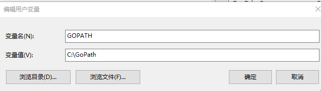
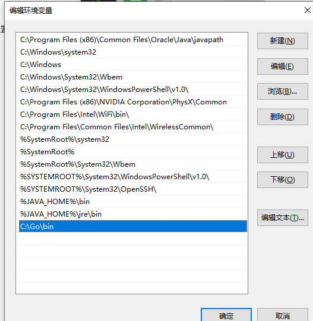

使用 github.com/Yqccc 作为基本路径：

创建hello文件夹，创建hello.go，并在VSCode中编写代码：
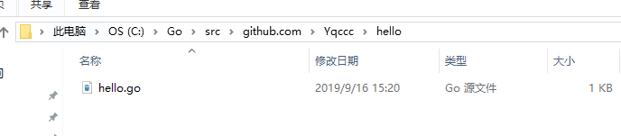
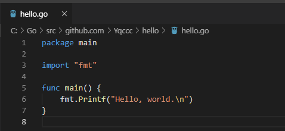

打开cmd，cd到hello.go所在文件夹，并使用install产生一个可执行的二进制文件：
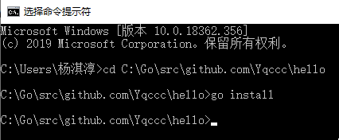

打开bin文件夹，发现有相应的可执行文件hello.exe：

cd到bin文件夹，输入hello，得到输出：

在src\github.com\Yqccc创建stringutil文件夹来保存库：
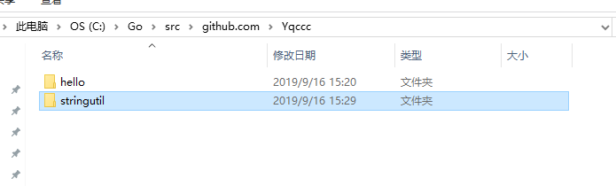

创建reverse.go并在VSCode编写代码：
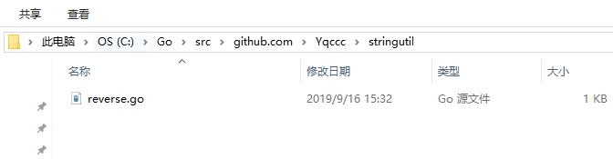
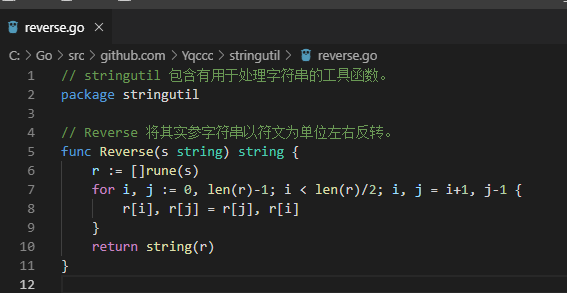

用 go build 命令来测试该包的编译：
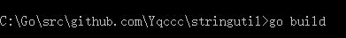

修改hello.go:
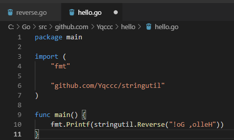

对hello.go进行install:

运行hello.exe:
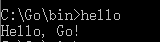

对reverse.go进行install:

查看pkg\windows_amd64\github.com\Yqccc发现有stringutil.a包：
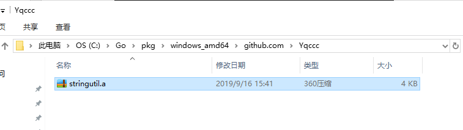

创建reverse_test.go并编写代码：
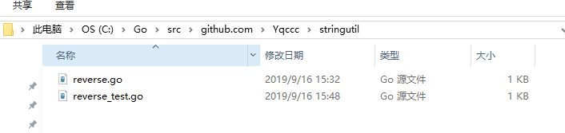
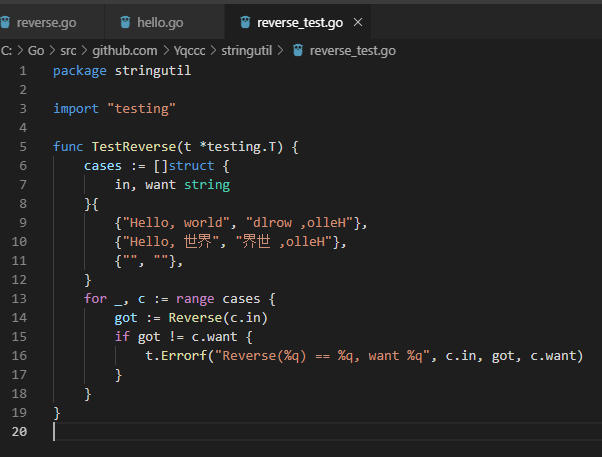

进行go test测试，通过：
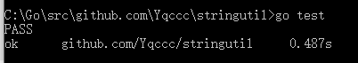

### 验收内容

* 正确的输出格式
* 使用**多态**实现

### 提交要求及命名格式

/src 存放项目文件

/report 存放项目报告

个人项目提交方式:

- 布置的个人项目先fork到个人仓库下；
- clone自己仓库的个人项目到本地目录；
- 在个人项目中，在src、report目录下，新建个人目录，目录名为“学号+姓名”，例如“12345678WangXiaoMing”；
在“src\12345678WangXiaoMing”目录下，保存项目，按要求完成作业;
- 实验报告以md的格式，写在“report\12345678WangXiaoMing”目录下；
- 完成任务需求后，Pull Request回主项目的master分支，PR标题为“学号+姓名”， 如“12345678王小明”；
- 一定要在deadline前PR。因为批改后，PR将合并到主项目，所有同学都能看到合并的结果，所以此时是不允许再PR提交作业的。
