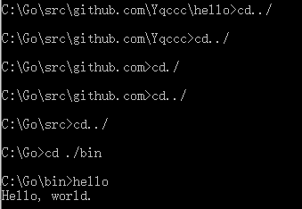

# HomeWork_GO_Package
第三周作业，go语言包

**操作系统：Win10**

配置环境变量： 
 
 

使用 github.com/Yqccc 作为基本路径： 
 

创建hello文件夹，创建hello.go，并在VSCode中编写代码： 
 
 

打开cmd，cd到hello.go所在文件夹，并使用install产生一个可执行的二进制文件： 
 

打开bin文件夹，发现有相应的可执行文件hello.exe： 
 

cd到bin文件夹，输入hello，得到输出： 
 

在src\github.com\Yqccc创建stringutil文件夹来保存库： 
 

创建reverse.go并在VSCode编写代码： 
 
 

用 go build 命令来测试该包的编译： 
 

修改hello.go: 
 

对hello.go进行install: 
 

运行hello.exe: 
 

对reverse.go进行install: 
 

查看pkg\windows_amd64\github.com\Yqccc发现有stringutil.a包： 
 

创建reverse_test.go并编写代码： 
 
 

进行go test测试，通过： 
 